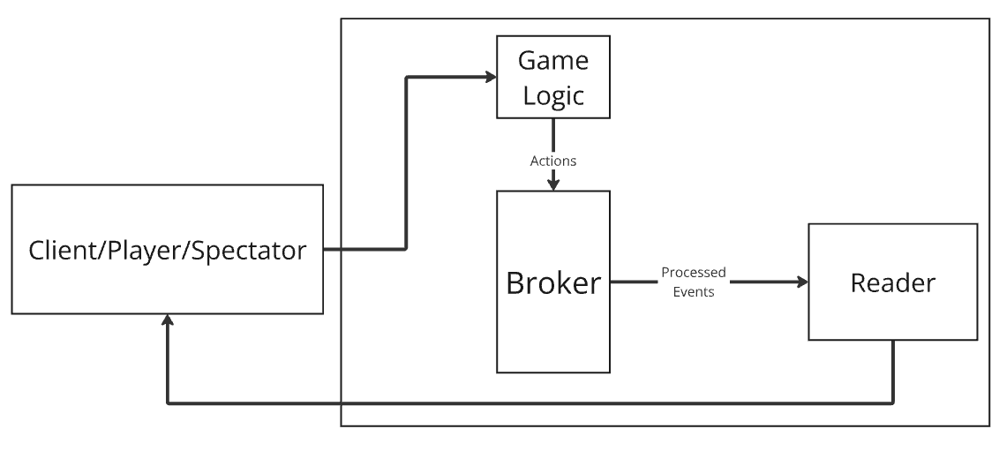
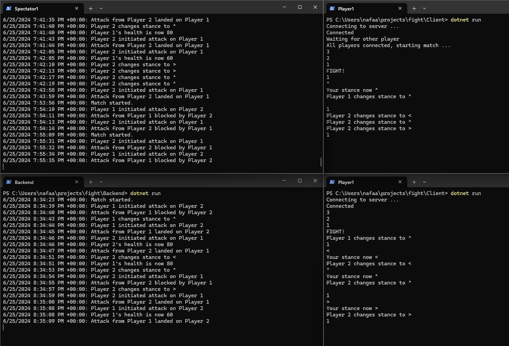

# Game Spectating System

A simple spectating system to provide live feedback of a game match.

Overview

## Game overview
The game match start with 2 players, when more players join, they will be spectators, watching the match events only.

**Inputs**

`<`, `^`, and `>` used to change guard direction.

`1` is used to initiate attack from player's the guard direction.

_This mini game is inspired by For Honor Battle system (Art of Battle Guard mode)_
https://forhonor.fandom.com/wiki/Art_of_Battle

## Spectator mode
Apache Pulsar is used here to process game events, such as initiated attacks, blocked attacks, landed attacks ...
after processing these events a Pulsar <a href="https://pulsar.apache.org/docs/3.3.x/client-libraries-readers/">Reader</a> watch for these events then send them to Client.

